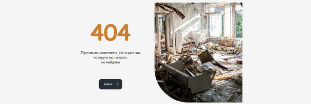

# Фреймворк Vue.js. Обучение в записи

# Урок 16. Семинар: Навигация в приложении Vue-Router
## Работа с макетом

Добавить переключение страниц через Vue Router.<br>
Сделать страницу 404, которая будет появляться,<br> 
если пользователь переходит по несуществующей ссылке.<br>
Доделать проект, если остались недоделанные части.<br>

<br>

#### Задание по работе с макетом направлено на подготовку проекта к итоговой аттестации.

<br><br>

#### Формат сдачи: ссылка на гитхаб.

<br><br>

### Решение задания

Перейти в папку с проектом и выполнить запуск:
```
npm run serve

```

<br><br>

#### Задача 1

Перед установкой роутера Vue Router обязательно <br>
требуется сохранить все полученные при создании проекта исходные файлы и папки. <br><br>

Если роутер не установлен еще в проект, следует установить роутер Vue-CLI:
- прочитать официальную страницу [Vue Router](https://v3.router.vuejs.org/ru/installation.html).
- предварительно скопировать содержимое (код) файлов main.js,App.vue и index.js, которые нужно будет заново указать после установки роутера (роутер затирает своим кодом эти файлы для инсталляции).
- открыть консоль в начальной директории проекта и в консоли ввести команду:
```
npm install vue-router

```
Добавить в src новую папку для роутера /router <br> 
и в ту папку в файл роутера index.js записать все компоненты, по которым будут маршруты и ссылки на сайте или приложении. <br><br>
```
import Vue from 'vue';
import Router from 'vue-router';
import Home from '@/components/Home.vue';
import Blog from '@/components/Blog.vue';
import BlogDetails from '@/components/BlogDetails.vue';
import ProjectDetails from '@/components/ProjectDetails.vue';
import Projects from '@/components/Projects.vue';

Vue.use(Router);

export default new Router({
  mode: 'history',
  routes: [
    { path: '/', name: 'Home', component: Home },
    { path: '/index', name: 'Home', component: Home },
    { path: '/project-details', name: 'ProjectDetails', component: ProjectDetails },
    { path: '/projects', name: 'Projects', component: Projects },
    { path: '/blog', name: 'Blog', component: Blog },
    { path: '/blog-details', name: 'BlogDetails', component: BlogDetails }
  ]
});
```

<br>

**В роутере необходимо указать все имеющиеся варианты ссылок <br>
(с прямым переходом в другую страницу или с переходом на якорь в другой странице)**

<br><br>

#### Задача 2

Создаем верстку html для страницы.



Добавляем страницу '404' как компонент NotFound.vue.

#### Задача 3

В Vue Router в файле router/index.js добавляем код для редиректа на страницу '404'

```
   {
            path: '/404',
            name: 'NotFound',
            component: NotFound
    },
        {
            path: '*',
            redirect: '/404'    
    }
```
Импортируем ссылку на компонент страницы '404' в файл router/index.js
```
import NotFound from '@/components/NotFound.vue';

```

При не правильном наборе адреса страницы для проекта, заставка переходит на страницу '404' в браузере.


<br><br><br><br>